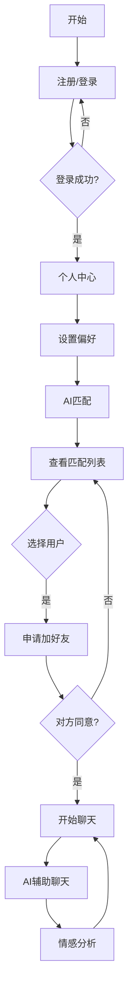

## 1. Product Overview
AI婚恋系统是一款基于人工智能的社交交友平台，帮助用户通过智能匹配找到理想伴侣。系统融合了先进的AI匹配算法、智能聊天辅助和情感分析功能，为用户提供全方位的婚恋交友体验。

## 2. Core Features

### 2.1 User Roles
| Role | Registration Method | Core Permissions |
|------|---------------------|------------------|
| Normal User | Email/Phone registration | Browse profiles, set preferences, AI matching, send friend requests, chat, use AI assistant |

### 2.2 Feature Module
1. **登录注册页**: 用户注册、登录、密码找回
2. **个人中心页**: 用户信息编辑、偏好设置
3. **匹配页**: AI智能匹配、查看匹配对象、申请加好友
4. **聊天页**: 实时聊天、AI辅助聊天、情感分析

### 2.3 Page Details
| Page Name | Module Name | Feature description |
|-----------|-------------|---------------------|
| 登录注册页 | 用户认证 | 邮箱/手机号注册、登录、验证码验证、密码加密 |
| 个人中心页 | 个人信息 | 头像上传、基本信息编辑、照片墙 |
| 个人中心页 | 偏好设置 | 年龄范围、性别偏好、兴趣爱好、地域选择、性格特征 |
| 匹配页 | AI匹配 | 基于偏好和AI算法推荐匹配对象 |
| 匹配页 | 筛选功能 | 按条件筛选匹配用户 |
| 匹配页 | 申请好友 | 发送好友申请、查看申请状态 |
| 聊天页 | 实时聊天 | 文字消息、表情发送、消息时间戳 |
| 聊天页 | AI辅助 | AI推荐聊天话题、话术建议 |
| 聊天页 | 情感分析 | AI分析对方情感状态、给出沟通建议 |

## 3. Core Process

### 用户流程
1. 用户注册 → 填写个人信息 → 设置偏好 → AI匹配 → 查看匹配对象 → 申请好友 → 聊天

### 匹配流程
用户设置偏好 → AI算法分析 → 生成匹配列表 → 用户浏览 → 发送好友申请 → 对方同意 → 开始聊天

### 聊天流程
进入聊天 → AI辅助建议 → 发送消息 → AI情感分析 → 持续对话

## 4. User Interface Design

### 4.1 Design Style
- **Primary Color**: 浪漫粉色系 (#FF6B9D, #FF8FA3)
- **Secondary Color**: 优雅紫色系 (#9B59B6, #8E44AD)
- **Button Style**: 圆角、渐变、hover效果
- **Font**: 优雅衬线字体搭配现代无衬线字体
- **Layout**: 卡片式布局、流畅过渡动画
- **Icon Style**: 精美线性图标、柔和配色

### 4.2 Page Design Overview
| Page Name | Module Name | UI Elements |
|-----------|-------------|-------------|
| 登录注册页 | 表单 | 渐变背景、圆角输入框、社交登录按钮 |
| 个人中心页 | 头部 | 圆形头像、用户信息卡片、编辑按钮 |
| 个人中心页 | 偏好设置 | 表单卡片、滑块选择、标签选择 |
| 匹配页 | 列表 | 卡片式用户展示、匹配度百分比、操作按钮 |
| 聊天页 | 消息区 | 气泡式消息、时间戳、表情按钮 |
| 聊天页 | AI辅助 | 浮动建议卡片、情感分析面板 |

### 4.3 Responsiveness
- Desktop-first design
- Mobile adaptive layout
- Touch-optimized buttons

### 4.4 Accessibility
- Semantic HTML
- ARIA labels
- Keyboard navigation support