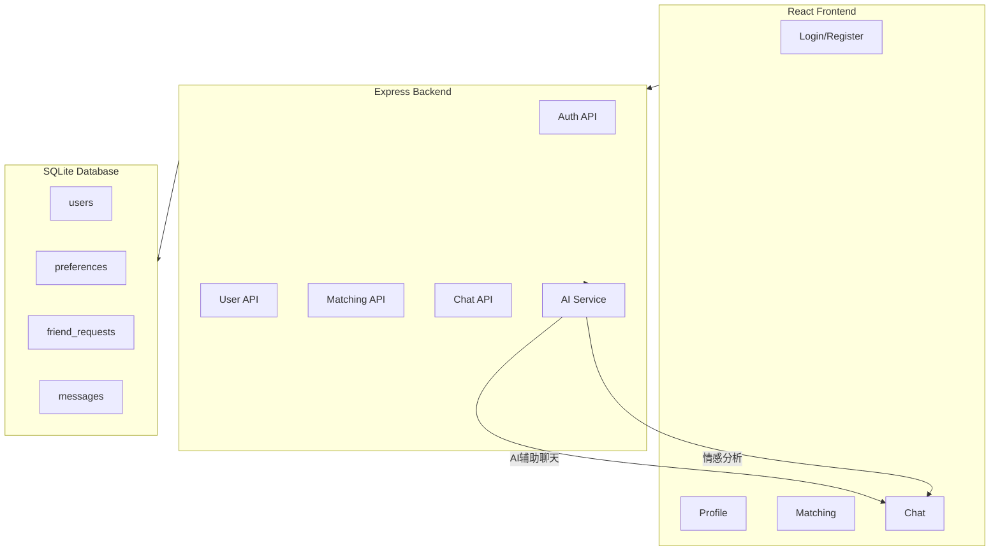
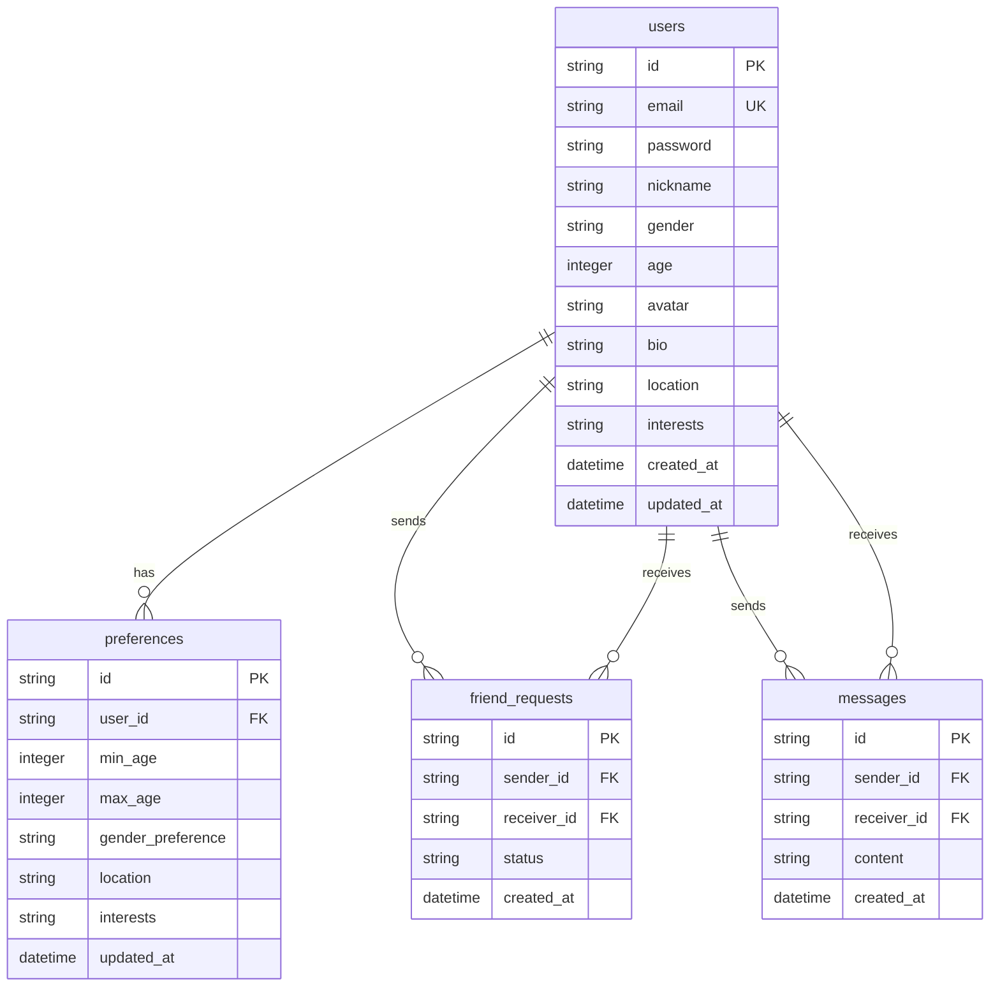

## 1. Architecture Design



## 2. Technology Description
- Frontend: React@18 + TypeScript + TailwindCSS@3 + Vite
- Backend: Express@4 + TypeScript
- Database: SQLite (文件数据库，无需额外安装)
- State Management: Zustand
- Icons: Lucide React

## 3. Route Definitions

| Route | Purpose |
|-------|---------|
| / | 登录页 |
| /register | 注册页 |
| /profile | 个人中心页 |
| /matching | 匹配页 |
| /chat/:id | 聊天页 |

## 4. API Definitions

### 4.1 Auth APIs

#### POST /api/auth/register
**Request:**
```typescript
{
  email: string;
  password: string;
  nickname: string;
  gender: 'male' | 'female';
  age: number;
}
```
**Response:**
```typescript
{
  success: boolean;
  message: string;
  user?: User;
}
```

#### POST /api/auth/login
**Request:**
```typescript
{
  email: string;
  password: string;
}
```
**Response:**
```typescript
{
  success: boolean;
  message: string;
  user?: User;
  token?: string;
}
```

### 4.2 User APIs

#### GET /api/users/profile
**Response:**
```typescript
{
  success: boolean;
  user: User;
}
```

#### PUT /api/users/profile
**Request:**
```typescript
{
  nickname?: string;
  avatar?: string;
  bio?: string;
  location?: string;
  interests?: string[];
}
```

#### PUT /api/users/preferences
**Request:**
```typescript
{
  minAge?: number;
  maxAge?: number;
  genderPreference?: 'male' | 'female' | 'both';
  location?: string;
  interests?: string[];
}
```

### 4.3 Matching APIs

#### GET /api/matching
**Response:**
```typescript
{
  success: boolean;
  matches: MatchResult[];
}
```

#### POST /api/matching/:userId/request
**Response:**
```typescript
{
  success: boolean;
  message: string;
}
```

#### GET /api/matching/requests
**Response:**
```typescript
{
  success: boolean;
  requests: FriendRequest[];
}
```

#### POST /api/matching/requests/:requestId/accept
**Response:**
```typescript
{
  success: boolean;
  message: string;
}
```

### 4.4 Chat APIs

#### GET /api/chat/:userId/messages
**Response:**
```typescript
{
  success: boolean;
  messages: Message[];
}
```

#### POST /api/chat/:userId/message
**Request:**
```typescript
{
  content: string;
}
```

#### GET /api/chat/suggestions
**Request:**
```typescript
{
  userId: string;
  context?: string;
}
```
**Response:**
```typescript
{
  success: boolean;
  suggestions: string[];
}
```

#### POST /api/chat/analyze
**Request:**
```typescript
{
  messages: string[];
}
```
**Response:**
```typescript
{
  success: boolean;
  analysis: {
    sentiment: 'positive' | 'neutral' | 'negative';
    suggestions: string[];
    emotion: string;
  };
}
```

## 5. Data Model

### 5.1 Data Model Definition



### 5.2 Data Definition Language

```sql
CREATE TABLE IF NOT EXISTS users (
    id TEXT PRIMARY KEY,
    email TEXT UNIQUE NOT NULL,
    password TEXT NOT NULL,
    nickname TEXT NOT NULL,
    gender TEXT NOT NULL CHECK(gender IN ('male', 'female')),
    age INTEGER NOT NULL,
    avatar TEXT DEFAULT '',
    bio TEXT DEFAULT '',
    location TEXT DEFAULT '',
    interests TEXT DEFAULT '[]',
    created_at DATETIME DEFAULT CURRENT_TIMESTAMP,
    updated_at DATETIME DEFAULT CURRENT_TIMESTAMP
);

CREATE TABLE IF NOT EXISTS preferences (
    id TEXT PRIMARY KEY,
    user_id TEXT NOT NULL REFERENCES users(id),
    min_age INTEGER DEFAULT 18,
    max_age INTEGER DEFAULT 50,
    gender_preference TEXT DEFAULT 'both',
    location TEXT DEFAULT '',
    interests TEXT DEFAULT '[]',
    updated_at DATETIME DEFAULT CURRENT_TIMESTAMP
);

CREATE TABLE IF NOT EXISTS friend_requests (
    id TEXT PRIMARY KEY,
    sender_id TEXT NOT NULL REFERENCES users(id),
    receiver_id TEXT NOT NULL REFERENCES users(id),
    status TEXT DEFAULT 'pending' CHECK(status IN ('pending', 'accepted', 'rejected')),
    created_at DATETIME DEFAULT CURRENT_TIMESTAMP
);

CREATE TABLE IF NOT EXISTS messages (
    id TEXT PRIMARY KEY,
    sender_id TEXT NOT NULL REFERENCES users(id),
    receiver_id TEXT NOT NULL REFERENCES users(id),
    content TEXT NOT NULL,
    created_at DATETIME DEFAULT CURRENT_TIMESTAMP
);
```

## 6. Initial Data

```sql
INSERT INTO users (id, email, password, nickname, gender, age, bio, location, interests) VALUES
('user1', 'user1@example.com', 'hash_password', '阳光男孩', 'male', 28, '热爱运动，喜欢旅行，寻找志同道合的另一半', '北京', '["运动", "旅行", "音乐"]'),
('user2', 'user2@example.com', 'hash_password', '文艺女孩', 'female', 25, '喜欢阅读和艺术，期待浪漫的相遇', '上海', '["阅读", "绘画", "音乐"]'),
('user3', 'user3@example.com', 'hash_password', '科技达人', 'male', 30, '程序员一枚，热爱生活，希望找到懂我的人', '深圳', '["编程", "电影", "美食"]'),
('user4', 'user4@example.com', 'hash_password', '温柔姐姐', 'female', 27, '性格温和，喜欢小动物，期待真诚的感情', '杭州', '["宠物", "烹饪", "瑜伽"]'),
('user5', 'user5@example.com', 'hash_password', '健身教练', 'male', 26, '健康生活倡导者，寻找积极向上的伴侣', '广州', '["健身", "户外", "摄影"]'),
('user6', 'user6@example.com', 'hash_password', '设计师小美', 'female', 24, '热爱设计，追求美好事物，期待灵魂伴侣', '成都', '["设计", "旅行", "美食"]');

INSERT INTO preferences (id, user_id, min_age, max_age, gender_preference, location, interests) VALUES
('pref1', 'user1', 22, 30, 'female', '北京', '["旅行", "音乐"]'),
('pref2', 'user2', 25, 32, 'male', '上海', '["阅读", "音乐"]'),
('pref3', 'user3', 23, 29, 'female', '深圳', '["电影", "美食"]'),
('pref4', 'user4', 25, 33, 'male', '杭州', '["宠物", "烹饪"]'),
('pref5', 'user5', 22, 28, 'female', '广州', '["健身", "户外"]'),
('pref6', 'user6', 25, 32, 'male', '成都', '["旅行", "美食"]');
```